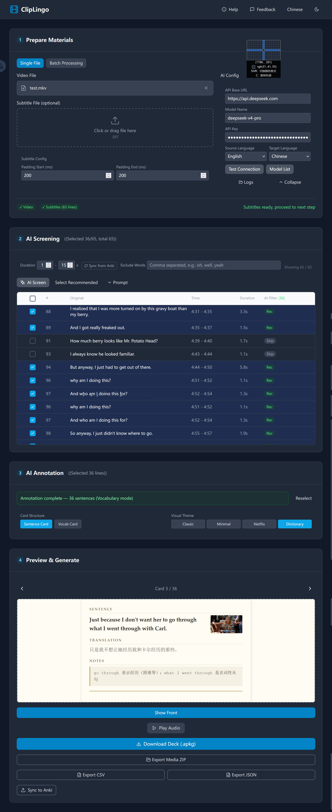

<p align="center">
  
</p>

<h1 align="center">ClipLingo</h1>

[中文](README_zh.md) | English

Automatically convert video + subtitle files into Anki decks.

**A tool for learning foreign languages through video subtitles** — supports any language pair, works without AI for basic use, and can intelligently select sentences worth learning when AI is configured.

## Why ClipLingo

|                      | ClipLingo                                                                                                  | subs2srs                             | LanguageReactor                            |
| -------------------- | ---------------------------------------------------------------------------------------------------------- | ------------------------------------ | ------------------------------------------ |
| **Runtime**          | Local, data never leaves your machine                                                                      | Local, but relies on Anki ecosystem  | Browser extension, always online           |
| **Privacy**          | All files and API keys processed locally                                                                   | Local                                | Video watch data uploaded to servers       |
| **AI**               | Optional, supports any OpenAI-compatible API (DeepSeek / OpenAI / Ollama, etc.)                            | No built-in AI                       | Built-in, but tied to their online service |
| **Language Pair**    | Any pair, freely switchable (Whisper supports ~100 languages, AI translation works with any language pair) | Mainly English                       | Mainly English                             |
| **Learning Curve**   | Download and use, full GUI                                                                                 | Requires familiarity with Anki + CLI | Browser extension, easy                    |
| **Output**           | AnkiConnect direct sync + .apkg export                                                                     | Requires Anki import                 | Online review only                         |
| **Subtitle Sources** | External SRT + embedded soft subs + Whisper transcription                                                  | External ASS/SRT                     | Online video subtitles only                |

In short: **subs2srs is powerful but has a steep learning curve; LanguageReactor is convenient but your data isn't yours. ClipLingo balances ease of use and privacy, with AI features entirely optional.**

## Download & Install

**Installer (Windows,Recommended):**

- `ClipLingo_Setup.exe` — Full installer with built-in Whisper transcription 

After installation, run `ClipLingo.exe` and open `http://localhost:8000` in your browser.

> **Note**: Install to a path with only English characters. Paths containing Chinese (or other non-ASCII) characters may cause the program to fail to start.

**Docker:**

```bash
git clone https://github.com/qinusui/ClipLingo.git
cd ClipLingo
docker-compose up -d
# Open http://localhost:8000 in your browser
```

> Requires [Docker Desktop](https://www.docker.com/products/docker-desktop/)

**Development:**

```bash
pip install -r requirements.txt && cd backend && pip install -r requirements.txt && cd ../frontend && npm install && cd ..
scripts\start.bat  # Windows
# or
./scripts/start.sh  # Linux/Mac
```

Requires Python 3.10+, ffmpeg (in PATH), and Node.js 18+.

## Features

- **AnkiConnect Sync**: Send cards directly to Anki without exporting .apkg files (requires [AnkiConnect](https://ankiweb.net/shared/info/2055492159) add-on), auto-uploads screenshots and audio, automatically skips duplicates
- **Bidirectional Learned Words Sync**: Extracts learned words from ClipLingo decks in Anki, auto-skip during AI screening; also supports local SQLite tracking
- **Whisper Transcription**: Built-in faster-whisper, transcribe video directly to subtitles (English/Japanese/Korean and more), cancellable, with timeout protection
- **Two-Phase AI Workflow**: Screen first (quick learning value assessment) → then annotate (generate translations and notes based on purpose), both prompts fully customizable
- **4 Built-in + Custom Card Themes**: Classic, Minimal Immersive, Netflix Stills, Dictionary — plus import your own HTML/CSS themes via ZIP
- **CSS Variable Editor**: Fine-tune built-in theme colors, fonts, spacing, and shadows with live preview; changes persist per theme and carry into .apkg generation and AnkiConnect sync
- **2 Card Structures**: Sentence cards (screenshot + audio → original text + translation + notes) and Vocab cards (word → definition + example)
- **Multi-Video Processing**: Upload multiple videos at once with per-video subtitle assignment; merge all into one deck or generate independent decks per video
- **Rule-Based Filtering**: Duration range, learned word exclusion, keyword blacklist — quickly filter large subtitle sets
- **Embedded Subtitle Extraction**: Auto-detect embedded soft subtitles in video files, no need to manually prepare SRT files

## Interface



## Configuration

### AI Configuration (Optional)

To use AI translation and smart screening, fill in the "AI Config" panel on the right:

- **Source / Target Language**: Select subtitle language and translation target language, supports 19 languages including Chinese, English, Japanese, Korean, French, German, Spanish
- **API Base URL**: Supports any OpenAI-compatible API (DeepSeek / OpenAI / Ollama, etc.)
- **Model Name**: Custom model name
- **API Key**: Automatically persisted to localStorage
- **Test Connection** / **List Models**: One-click configuration verification
- **Custom Prompts**: Both screening and annotation prompts can be independently edited, with "Grammar & Sentence Pattern" and "Vocabulary" presets

> **Privacy & Security**: API keys are stored only in your browser's localStorage. They are never uploaded to any server and are only used locally when communicating with the localhost backend. Clear your browser data when sharing a computer.

### Subtitle Processing

Adjust in the left "Subtitle Processing Config" panel:

- **Min Duration**: Filter out subtitles that are too short (default 1.0s)
- **Padding Start**: Audio clipping head padding (default 200ms)
- **Padding End**: Audio clipping tail padding (default 200ms)

### Multi-Video Processing

Upload multiple videos at once — each video can have its own subtitle file assigned, or let Whisper auto-transcribe videos without subtitles. Two output modes:

- **Merge (default)** — all videos' cards combined into one Anki deck
- **Independent** — each video gets its own deck

After uploading the first video, an "Add More" drop zone stays visible for easy batch addition. Processing progress shows which video is currently being processed and at what step.

## Workflow

The interface uses a four-step vertical layout:

1. **Prepare**: Upload one or more video files along with optional subtitle files (or auto-generate via Whisper). A video list table lets you assign subtitles per video, remove videos, or continue adding more. Choose merge mode (one combined deck) or independent mode (one deck per video).
2. **AI Screen**: Set filter rules (duration/exclusion words), then click "AI Screen" — the table shows real-time recommendation/skip badges
3. **AI Annotate**: Choose purpose (Grammar / Vocabulary), wait for annotation to complete
4. **Style & Preview**: Choose card structure (sentence/vocab), visual theme (built-in or custom), fine-tune CSS variables for built-in themes, then preview card effects. Click "Generate" when satisfied. Then sync to Anki or download .apkg deck

**Two usage modes:**

- **Basic Mode** (no AI): Upload video → auto-extract/transcribe subtitles → rule filter or manual selection → generate cards
- **AI Mode** (optional): Configure AI → AI Screen → choose purpose & annotate → preview theme → generate cards

> Learned words are automatically recorded to local SQLite, and both AI screening and rule-based filtering will automatically skip them on subsequent runs.

### AnkiConnect Sync

No need to manually import .apkg files — cards can be synced directly to Anki:

1. Install [Anki](https://apps.ankiweb.net/) and keep it running
2. Install the AnkiConnect add-on: Anki → Tools → Add-ons → Get Add-ons → enter code `2055492159` → restart Anki
3. After processing cards in ClipLingo, click the **"Sync to Anki"** button
4. On first use, Anki will show a permission confirmation dialog — click "Allow"

The sync process auto-creates decks (`ClipLingo::videoName`), uploads screenshot and audio media files, and skips duplicate cards. You can also click **"Sync from Anki"** in the subtitle filter area to import learned words from Anki back into ClipLingo.

### AI Two-Phase Workflow

```
AI Screen (fast, returns only include/skip + reason)
    ↓ User confirms selection
Choose purpose: Grammar or Vocabulary
    ↓ AI generates translations and annotations based on purpose
Choose card structure + visual theme + optional CSS tweaks
    ↓ Real-time preview
Generate → Sync to Anki / Download .apkg
```

## Card Formats

### Card Structures

| Structure         | Front                                | Back                                             |
| ----------------- | ------------------------------------ | ------------------------------------------------ |
| **Sentence Card** | Screenshot + Audio (tests listening) | Original text + Translation + Notes              |
| **Vocab Card**    | Word (large display)                 | Definition + Example (with screenshot and audio) |

Both structures can be selected simultaneously to generate two sets of cards at once.

### Visual Themes

| Theme                 | Style                                                              |
| --------------------- | ------------------------------------------------------------------ |
| **Classic**           | Clean and simple, blue tones, suitable for daily study             |
| **Minimal Immersive** | Serif fonts, paper texture, warm tones                             |
| **Netflix**           | Dark background, red accents, cinematic feel                       |
| **Dictionary**        | Parchment background, gold accents, professional dictionary layout |
| **Custom (import)**   | Any HTML/CSS template imported via ZIP, fully custom look          |

Themes and structures can be freely combined, with real-time preview before generation.

### Theme Customization

**CSS Variable Editor** (built-in themes only): Tweak individual visual properties — background color, text color, accent color, fonts, font sizes, padding, border radius, and shadow — with instant live preview. Changes are saved per theme and automatically applied to .apkg generation and AnkiConnect sync.

**Custom Theme Import** (ZIP packages): Import fully custom card templates for complete control over HTML/CSS. A valid theme ZIP contains:

```
my-theme.zip
├── theme.json    # { "name": "my-theme", "label": "My Theme", "version": 1 }
├── front.html    # Front template (use {{sentence}}, {{translation}}, etc.)
├── back.html     # Back template
└── style.css     # Stylesheet
```

Template variables use lowercase for convenience (`{{sentence}}`, `{{translation}}`, `{{annotation}}`, `{{audio}}`, `{{screenshot}}`, `{{word}}`, `{{definition}}`) — these are automatically mapped to Anki's standard field names. Anki conditional syntax (`{{#word}}...{{/word}}`, `{{^screenshot}}...{{/screenshot}}`) is fully supported.

## Example


## License

This project is licensed under the MIT License.  
See the [LICENSE](LICENSE) file for details.
