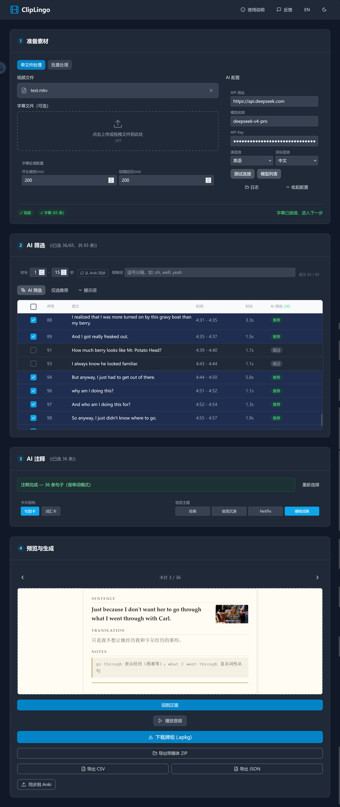

<p align="center">
  
</p>

<h1 align="center">ClipLingo</h1>

中文 | [English](README.md)

将视频 + 字幕文件自动转换为可导入 Anki 的牌组。

**定位：通过视频字幕学习外语的工具** — 支持任意语言对，无需 AI 即可使用基础功能，配置 AI 后可智能筛选有学习价值的句子。

## 为什么选择 ClipLingo

|           | ClipLingo                                         | subs2srs           | LanguageReactor |
| --------- | ------------------------------------------------- | ------------------ | --------------- |
| **运行方式**  | 本地运行，数据不离开你的电脑                                    | 本地运行，但依赖 Anki 插件生态 | 浏览器插件，在线服务      |
| **隐私**    | 所有文件和 API Key 仅在本地处理                              | 本地                 | 视频观看数据上传至服务器    |
| **AI 功能** | 可选，支持任意 OpenAI 兼容接口（DeepSeek / OpenAI / Ollama 等） | 无内置 AI             | 内置，但绑定其在线服务     |
| **语言对**   | 任意语言对，自由切换（Whisper 支持约 100 种语言，AI 翻译更是任意语言对都行）    | 英语为主               | 英语为主            |
| **上手难度**  | 下载即用，图形界面                                         | 需要熟悉 Anki + 命令行工具  | 浏览器插件，简单        |
| **输出格式**  | AnkiConnect 直接同步 + .apkg 导出                       | 需要配合 Anki 导入       | 仅支持在线复习         |
| **字幕来源**  | 外挂 SRT + 内嵌软字幕 + Whisper 转录                       | 外挂 ASS/SRT         | 仅在线视频字幕         |

简而言之：**subs2srs 功能强大但上手门槛高，LanguageReactor 方便但数据不在自己手里。ClipLingo 兼顾易用性和隐私，AI 功能完全可选。**

## 下载与安装

**安装版（Windows,推荐）：**

- `ClipLingo_Setup.exe` — 主程序安装包，内置 Whisper 转录

安装后启动 `ClipLingo.exe`，浏览器自动访问 `http://localhost:8000`。

> **注意**：安装路径请使用纯英文，含中文的路径会导致程序无法正常启动。

**Docker：**

```bash
git clone https://github.com/qinusui/ClipLingo.git
cd ClipLingo
docker-compose up -d
# 浏览器访问 http://localhost:8000
```

> 需要先安装 [Docker Desktop](https://www.docker.com/products/docker-desktop/)

**开发环境：**

```bash
pip install -r requirements.txt && cd backend && pip install -r requirements.txt && cd ../frontend && npm install && cd ..
scripts\start.bat  # Windows
# 或
./scripts/start.sh  # Linux/Mac
```

需要 Python 3.10+、ffmpeg（PATH 中）、Node.js 18+。

## 核心功能

- **AnkiConnect 同步**：无需导出 .apkg，直接将卡片发送到 Anki（需安装 [AnkiConnect](https://ankiweb.net/shared/info/2055492159) 插件），自动上传截图和音频，自动跳过重复卡片
- **已学词汇双向同步**：从 Anki 的 ClipLingo 牌组中提取已学单词，AI 筛选时自动跳过；也支持本地 SQLite 记录
- **Whisper 转录**：内置 faster-whisper，支持视频直接转录为字幕（英/日/韩等多语言），可取消、有超时保护
- **两阶段 AI 工作流**：先筛选（快速判断学习价值）→ 再注释（根据用途生成翻译和注释），筛选和注释提示词均可自定义
- **4 种卡片主题**：经典、极简沉浸、Netflix 剧照、硬核词典，风格迥异，预览即所得
- **2 种卡片结构**：句型卡（截图+音频 → 原文+翻译+注释）和词汇卡（单词 → 释义+例句）
- **多视频处理**：支持同时上传多个视频，每个视频独立分配字幕，可合并为一个牌组或各自独立输出
- **规则筛选**：时长范围、已学排除、关键词黑名单，快速过滤大量字幕
- **内嵌字幕提取**：自动检测视频内嵌软字幕，无需手动准备 SRT 文件

## 界面展示



## 配置

### AI 配置（可选）

如需使用 AI 翻译和智能筛选功能，在界面右侧「AI 配置」栏填写：

- **源语言 / 目标语言**：选择字幕语言和翻译目标语言，支持中、英、日、韩、法、德、西等 19 种语言
- **API 地址**：支持 OpenAI 兼容接口（DeepSeek / OpenAI / Ollama 等）
- **模型名称**：自定义模型
- **API Key**：自动持久化到 localStorage
- **测试连接** / **获取模型列表**：一键验证配置
- **提示词自定义**：筛选和注释提示词均可独立编辑，预设「语法句型」和「背单词」两种模板，支持自由修改

> **隐私安全**：API Key 仅存储在浏览器本地（localStorage），不会上传到任何服务器，仅在本机与 localhost 后端通信时使用。电脑共用时注意清理浏览器数据。

### 字幕处理配置

左侧「字幕处理配置」栏可调整：

- **最短时长**：过滤过短的字幕（默认 1.0 秒）
- **开头提前**：音频切割时的头部 padding（默认 200ms）
- **结尾延后**：音频切割时的尾部 padding（默认 200ms）

### 多视频处理

可直接上传多个视频——每个视频可独立指定字幕文件，无字幕的视频自动使用 Whisper 转录。两种输出模式：

- **合并模式（默认）** — 所有视频的卡片合并到一个 Anki 牌组
- **独立模式** — 每个视频各自生成独立牌组

上传第一个视频后，「继续添加」拖拽区保持可见，方便批量导入。处理进度条实时显示当前处理到第几个视频的哪个步骤。

## 使用流程

界面采用四步纵向布局：

1. **准备素材**：上传一个或多个视频，可逐视频分配字幕（或自动生成）。视频列表表格支持增删，可选择合并模式（一个牌组）或独立模式（每个视频独立牌组）
2. **AI 筛选**：先设过滤规则（时长/排除词），再点「AI 筛选」，表格实时更新推荐/跳过徽章
3. **AI 注释**：选择用途（语法句型 / 背单词），等待注释完成；等待期间可提前选择卡片结构和视觉主题
4. **预览与生成**：预览卡片效果，满意后点击「开始处理」——进度条实时显示「视频 X/N」和当前步骤，完成后同步到 Anki 或下载 .apkg 牌组

**两种使用模式：**

- **基础模式**（无需 AI）：上传视频 → 自动提取/转录字幕 → 规则筛选或手动勾选 → 生成卡片
- **AI 模式**（可选）：配置 AI → AI 筛选 → 选择用途 & 注释 → 预览主题 → 生成卡片

> 已学会的单词自动记录到本地 SQLite，下次运行时 AI 筛选和规则过滤会自动跳过已学词汇。

### AnkiConnect 同步

无需手动导入 .apkg 文件，卡片可直接同步到 Anki：

1. 安装 [Anki](https://apps.ankiweb.net/) 并保持运行
2. 安装 AnkiConnect 插件：Anki → 工具 → 插件 → 获取插件 → 输入代码 `2055492159` → 重启 Anki
3. 在 ClipLingo 处理完卡片后，点击 **「同步到 Anki」** 按钮
4. 首次使用时 Anki 会弹出权限确认窗口，点击「允许」即可

同步过程会自动创建牌组（`ClipLingo::视频名`）、上传截图和音频媒体文件、跳过重复卡片。也可以在字幕筛选区域点击 **「从 Anki 同步」** 将 Anki 中已学词汇同步回 ClipLingo。

### AI 两阶段工作流

```
AI 筛选（快速，只返回推荐/跳过 + 原因）
    ↓ 用户确认选择
选择用途：语法句型 or 背单词
    ↓ AI 根据用途生成翻译和注释
选择卡片结构 + 视觉主题
    ↓ 实时预览
开始处理 → 同步到 Anki / 下载 .apkg
```

## 卡片格式

### 卡片结构

| 结构      | 正面            | 背面              |
| ------- | ------------- | --------------- |
| **句型卡** | 截图 + 音频（考察听力） | 原文 + 翻译 + 注释    |
| **词汇卡** | 单词（大字展示）      | 释义 + 例句（含截图和音频） |

两种结构可同时选中，一次生成两套卡片。

### 视觉主题

| 主题          | 风格                |
| ----------- | ----------------- |
| **经典**      | 清爽简洁，蓝色调，适合日常学习   |
| **极简沉浸**    | 衬线字体，纸质书质感，暖色调    |
| **Netflix** | 暗色背景，红色点缀，电影剧照感   |
| **硬核词典**    | 羊皮纸底色，金色装饰，专业词典排版 |

主题和结构自由组合（2×4 = 8 种搭配），处理前可实时预览。

### 主题定制

**CSS 变量编辑器**（仅内置主题）：可微调背景色、文字色、强调色、字体、字号、内边距、圆角和阴影，所见即所得。修改按主题独立保存，自动应用到 .apkg 生成和 AnkiConnect 同步。

**自定义主题导入**（ZIP 模板包）：导入完全自定义的 HTML/CSS 卡片模板。详见[自定义卡片模板指南](docs/cliplingo-custom-themes.md)。合法的主题 ZIP 包含：

```
my-theme.zip
├── theme.json    # { "name": "my-theme", "label": "我的主题", "version": 1 }
├── front.html    # 正面模板（使用 {{sentence}}、{{translation}} 等变量）
├── back.html     # 背面模板
└── style.css     # 样式表
```

模板变量使用小写（`{{sentence}}`、`{{translation}}`、`{{annotation}}`、`{{audio}}`、`{{screenshot}}`、`{{word}}`、`{{definition}}`），会自动映射为 Anki 标准字段名。完整支持 Anki 条件语法（`{{#word}}...{{/word}}`、`{{^screenshot}}...{{/screenshot}}`）。

## 卡片示例


## License

This project is licensed under the MIT License.  
See the [LICENSE](LICENSE) file for details.
